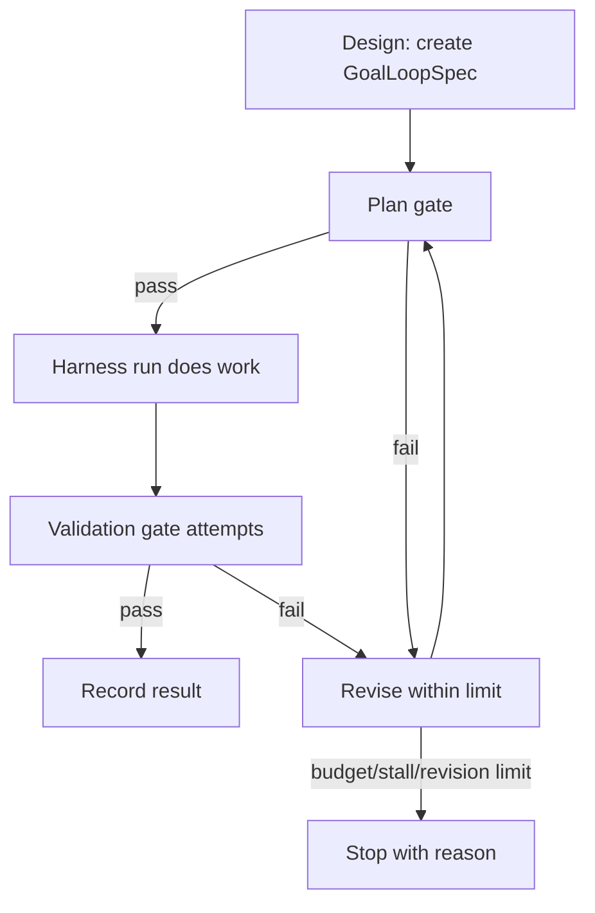

# Goal Loops in Klide

This note explains the "loop / goal mode" pattern in Klide terms.

## The honest read

The market is converging on the same idea under different names:

- agent loop: model decides, calls tools, reads results, repeats
- workflow graph: explicit nodes, edges, state, and stop conditions
- goal loop: a bounded loop around a goal, definition of done, review gates,
  revision budget, and final evidence
- deterministic replay: record the first successful tool path, then replay it
  cheaply for recurring work

For Klide, the useful part is not "let the model run forever." The useful part
is "make done falsifiable." A run is not done because the model says it is done.
A run is done when the required gates pass or the loop records why it stopped.

## Klide mapping

Klide already has most of the raw material:

| Loop concept | Klide concept |
|---|---|
| goal | `Mission.intent` or first user request |
| context | workspace attachments, Lens items, Project Memory, Transcript |
| actions | existing Rust Harness tools |
| feedback | Tool results, Diff review, command output, reviewer notes |
| state | Transcript + Mission state + `GoalLoopState` |
| stop | max turns, budget, failed gates, stalled revisions, user cancel |
| boundary | mode filtering, permission engine, Diff review |

The implementation rule is simple: keep Rust as the only tool-executing loop.
Goal loops sit above it as a supervisor contract.

## Flow

## Files

- `HARNESS_CONTRACT.md`: names the contract and the trust boundary.
- `src/agent/goalLoop.ts`: pure state machine for specs, gates, attempts,
  next action, and stop reasons.
- `src/agent/validationContracts.ts`: validation checks can be converted into
  loop gates and gate attempts.
- `src/agent/budgetLedger.ts`: budget presets feed loop limits.
- `src-tauri/src/agent/mod.rs`: remains the provider/tool loop.

## Product shape

The right first UI is not a giant autonomous-mode dashboard. It is a quiet
Mission Control detail:

- goal
- definition of done
- active gate
- revision count
- evidence from the transcript
- final stop reason

That gives users confidence without making normal Goal mode feel heavy.
