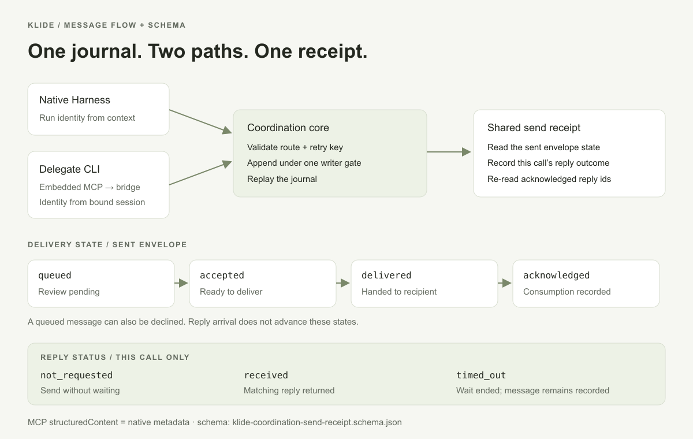

# Klide Run Coordination — Schema and Command Contract

Source of truth:

- Rust domain and persistence: `src-tauri/src/coordination.rs`
- TypeScript wire mirror: `src/agent/coordination.ts`
- Supervisor command schema: `schemas/klide-coordination-command.schema.json`
- Durable event schema: `schemas/klide-coordination-event.schema.json`
- Snapshot schema: `schemas/klide-coordination-snapshot.schema.json`
- Send receipt schema: `schemas/klide-coordination-send-receipt.schema.json`

## Event line schema v1

Every line in `.klide/coordination/events.jsonl` has this envelope:

```json
{
  "schemaVersion": 1,
  "seq": 7,
  "ts": 1788282000000,
  "event": {
    "type": "envelope_delivered",
    "envelopeId": "env_a21d…",
    "runId": "run_child"
  }
}
```

`seq` starts at zero and is contiguous. The reader rejects an unreadable line,
a gap, a duplicate, or a version newer than the current build before it returns
any projection.

### Event vocabulary

| Event | Meaning |
|---|---|
| `run_registered` | Immutable identity and initial normalized state were accepted |
| `run_state_changed` | One authorized state transition occurred |
| `envelope_queued` | A semantic payload was durably addressed |
| `envelope_accepted` | The receiving side approved delivery |
| `envelope_declined` | The receiving side refused delivery |
| `envelope_delivered` | The execution adapter projected it into the recipient at a safe boundary |
| `envelope_acknowledged` | The recipient consumed it |
| `cancel_requested` | An authorized actor requested supervisor cancellation |
| `result_published` | The Run published its single structured outcome |

## Stable Run registration

```json
{
  "runId": "run_1788282000000_a21d",
  "workerKind": "harness",
  "parentRunId": "run_parent",
  "missionId": "release-061",
  "missionTaskId": "verify-bundle",
  "label": "Bundle verifier"
}
```

- `runId` is the immutable address; panel ids, pane ids, and process ids are not
  routing identities.
- `workerKind` is `harness` or `delegate`.
- `parentRunId` must already exist before child registration.
- Mission identity is an all-or-nothing `(missionId, missionTaskId)` pair.
- The remaining metadata is frozen. An identical retry is idempotent; different
  metadata for the same Run is rejected.

## Normalized state

The cross-adapter vocabulary is:

```text
queued | starting | working | blocked | waiting | reviewing |
done | failed | cancelled
```

- `blocked` means external input or authority is required.
- `waiting` means the Run is intentionally waiting for another Run or process.
- `reviewing` means work exists but is passing a review/admission gate.
- `done`, `failed`, and `cancelled` are terminal.

State events record `fromState` and `toState`. Replay verifies the previous
state and the legal transition graph, so reordered or contradictory events fail
closed.

## Coordination actor

```json
{ "type": "operator" }
```

or:

```json
{ "type": "run", "runId": "run_parent" }
```

The generic supervisor schema contains an actor because native Klide IPC is a
trusted seam. Remote adapters must replace it with the identity authenticated
by their connection/session; callers cannot self-assert a Run id.

## Envelope

```json
{
  "id": "env_a21d…",
  "from": { "type": "run", "runId": "run_parent" },
  "toRunId": "run_child",
  "kind": "question",
  "body": "Which parser invariant is still unverified?",
  "replyTo": "env_98bc…",
  "correlationId": "parser-audit",
  "idempotencyKey": "parent-turn-4-question-1",
  "sourceRefs": [
    {
      "sourceType": "file",
      "id": "coordination-parser",
      "path": "src-tauri/src/coordination.rs",
      "lineStart": 720,
      "lineEnd": 910
    }
  ],
  "createdAtMs": 1788282000000
}
```

`kind` is `instruction`, `question`, `answer`, `progress`, or `handoff`. Body
size is capped at 32 KiB. A new Run-authored reply must reverse the original
route: the original recipient sends to the original sender. The trusted operator may
reply to the original sender on the recipient's behalf. This relational rule
is enforced against the journal by Rust, beyond JSON Schema validation.
Historical records retain their existing replay rules. File paths are
Workspace-relative. External adapters remove any machine-local data not
represented by this public shape.

Delivery is monotonic:

| State | Required next command |
|---|---|
| `queued` | `review_envelope` by the receiving side: accept or decline |
| `accepted` | `mark_envelope_delivered` by the addressed Run adapter |
| `delivered` | `acknowledge_envelope` by the addressed Run |
| `acknowledged` | Terminal delivery state |
| `declined` | Terminal delivery state; never delivered |

## Coordination result

```json
{
  "id": "result_91fe…",
  "runId": "run_child",
  "status": "succeeded",
  "summary": "Added strict journal replay and verified corrupt-line failures.",
  "artifacts": [
    {
      "kind": "file",
      "reference": "src-tauri/src/coordination.rs",
      "label": "Coordination core"
    },
    {
      "kind": "commit",
      "reference": "f00ba7",
      "label": "Implementation commit"
    }
  ],
  "sourceRefs": [
    { "sourceType": "transcript", "id": "run_child:0-42" }
  ],
  "publishedAtMs": 1788282300000
}
```

Status is `succeeded`, `partial`, `failed`, or `cancelled`. Artifact kinds are
`file`, `commit`, `transcript`, `diff`, and `memory`. A Run publishes one final
result; an identical retry is idempotent and a different second result is
rejected.

## Snapshot contract

```json
{
  "schemaVersion": 1,
  "nextSeq": 12,
  "runs": [],
  "envelopes": [],
  "results": []
}
```

`nextSeq` is an inclusive event cursor. After reading the snapshot, a consumer
calls:

```ts
readCoordinationEvents(workspaceRoot, snapshot.nextSeq)
```

The snapshot contains:

- registrations, current state/reason, registration and transition times;
- the latest cancellation request for each Run;
- envelopes and their delivery/acknowledgement timestamps;
- structured results.

It contains no second source of truth. Rust produces it by folding the journal.

## Command mapping

| Rust command type | Current Tauri IPC | Native authenticated agent Tool |
|---|---|---|
| `register_run` | `coordination_apply_command` | supervisor-owned only |
| `set_run_state` | `coordination_apply_command` | adapter-owned only |
| `send_envelope` | `coordination_apply_command` | `agent_send` |
| `mark_envelope_delivered` | `coordination_apply_command` | adapter-owned only |
| `acknowledge_envelope` | `coordination_apply_command` | adapter-owned only |
| `request_cancel` | `coordination_apply_command` | `agent_cancel` |
| `publish_result` | `coordination_apply_command` | supervisor-owned terminal publish |
| snapshot read | `coordination_snapshot` | `agent_list` / resource |
| cursor read | `coordination_events` | subscription/resource updates |

`agent_wait` combines authenticated snapshot reads with delivery and
acknowledgement commands. `agent_read_result` reads the authorized result
projection without introducing another durable record.

The embedded MCP adapter maps identity-bound agent Tools onto these Rust
operations. It does not persist its own inbox, infer state from terminal output,
or bypass Workspace-scoped authorization.

## Send receipt

`agent_send` returns the same typed receipt in MCP `structuredContent` and
native `ToolResult.metadata`. The MCP tool advertises the self-contained
[JSON Schema](schemas/klide-coordination-send-receipt.schema.json) as its
`outputSchema`, following the [MCP structured result contract](https://modelcontextprotocol.io/specification/2025-06-18/server/tools#output-schema).

```json
{
  "envelopeId": "env_example",
  "deliveryState": "acknowledged",
  "replyStatus": "timed_out",
  "timedOut": true,
  "text": "Message env_example for @run_b: acknowledged. No reply arrived within the wait window; the message remains recorded."
}
```

This is a successful send whose recipient consumed the message, but did not
answer within this call's wait window.

| Field | Meaning |
|---|---|
| `envelopeId` | Stable id of the sent message; an identical idempotent retry keeps it |
| `deliveryState` | Sent message's journal state at observation: queued, accepted, delivered, acknowledged, or declined |
| `replyStatus` | `not_requested`, `received`, or `timed_out` for this call only |
| `timedOut` | Always present; true exactly when `replyStatus` is `timed_out` |
| `replies` | Present only for `received`; non-empty reply snapshots refreshed after the wait acknowledges them |
| `text` | Human-readable receipt, including returned reply bodies |

Receipt fields describe a snapshot, not a promise that no later event can
occur. Receiving a reply does not fabricate acknowledgement of the original
message. Waiting until timeout does not cancel the message or reset its
state. An identical retry reports the existing message's current state;
reuse of the same key for a different intent remains an error.

`replyStatus` and explicit false `timedOut` values are additive. Consumers
that previously interpreted `deliveryState: acknowledged` as “a reply arrived”
must use `replyStatus: received`. Errors remain tool errors (`isError: true`),
not successful send receipts. The journal stays at schema version 1 because
no stored event or snapshot shape changes.


