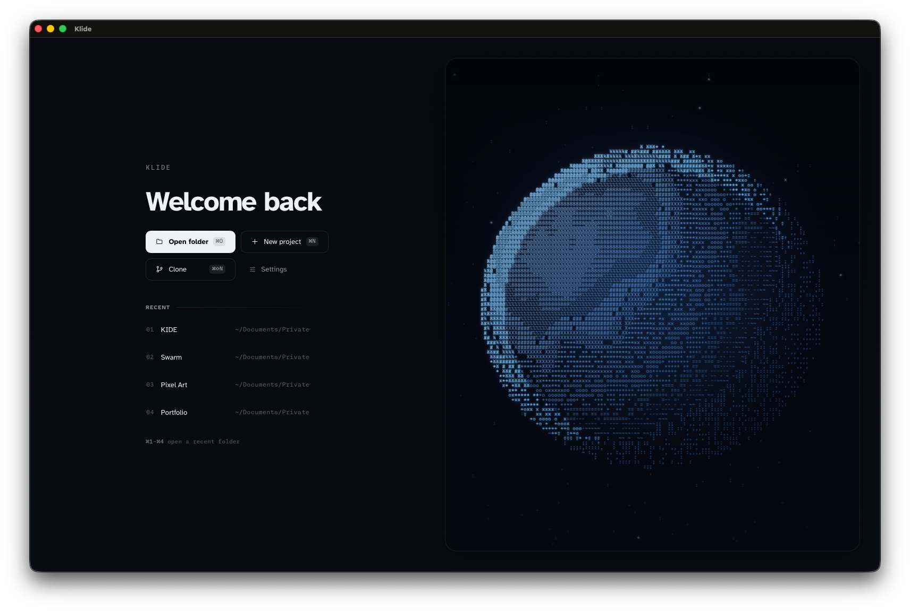

<div align="center">

# Klide

### The local-first agent IDE that keeps you in control.

Run local models, steer Codex / Claude Code / OpenCode, review every change, and keep your coding agents visible.

<br/>

[](https://v2.tauri.app)
[](https://www.rust-lang.org)
[](https://react.dev)
[](https://www.typescriptlang.org)
[](https://ollama.com)


<br/>

[**Get started**](#getting-started) &nbsp;&bull;&nbsp; [Features](#features) &nbsp;&bull;&nbsp; [Development](#development) &nbsp;&bull;&nbsp; [Roadmap](#roadmap)

<br/>



</div>

---

**Klide is a small, fast, AI-native coding workbench for developers who want agent speed without black-box autonomy.** It keeps the VS Code structure you already know — activity bar, explorer, tabs, editor, terminal, status bar — but the center of gravity is the agent loop: modes, context, diffs, skills, workspace state, and run evidence stay close to the work.

Local models run out of the box through Ollama / MLX. Online providers and subscription CLIs are opt-in. Codex, Claude Code, and OpenCode run as real embedded terminals, while Klide's own Rust harness can read code, draft plans, propose diff-reviewed edits, and run approval-gated commands.

| What you get | Why it matters |
|---|---|
| **Mission Control for agents** | See what is running, what needs you, and what changed across Klide runs and delegate CLIs. |
| **Local-first model support** | Start with Ollama / MLX, then add hosted providers only when you want them. |
| **Real delegate terminals** | Use Codex, Claude Code, and OpenCode without flattening their CLIs into a fake chat UI. |
| **Review before trust** | File edits, commands, memory drafts, and validation evidence stay visible before they become durable. |
| **Tauri-light desktop shell** | A native webview app with a ~10 MB binary instead of Electron-scale overhead. |

> **VS Code's structure · a calm, minimal aesthetic · agent harness transparency** — built for people who want to steer coding agents, not babysit hidden automation.

## Why Klide

Most editors fall into two camps: heavy (VS Code, JetBrains — powerful, but busy chrome and AI bolted on) or niche (Zed, Lapce, Helix — beautiful, but you give up your muscle memory). Klide aims for a third spot: a calm operator surface for code work where the agent can act, the risky parts are gated, and the UI stays quiet until you need deeper control. Inspired by [Sinew](https://sinew-ide.com/), with a nod to [Ara](https://ara.so/), [Cursor](https://cursor.com), and [Cline](https://cline.bot).

## Features

**Editor & shell**

- Familiar layout: activity bar, file explorer, multi-file tabs, Monaco editor, real PTY terminal, status bar
- Command palette (`⌘P` files, `⌘⇧P` commands), find-in-files, Git review workbench, keyboard-shortcut cheatsheet (`⌘/`)
- Light + dark themes shared across app, editor, and terminal — including per-theme terminal ANSI palettes

**AI panel**

- Streaming chat across local (Ollama, MLX) and hosted providers (Anthropic, OpenAI-compatible, Mistral, xAI, OpenRouter) plus self-hosted endpoints — all behind one switcher, all streamed through Rust so API keys never enter the webview
- Real delegate terminals: Claude Code, Codex, OpenCode, Oh My Pi, and user-defined CLI agents run inside embedded PTYs — the actual CLI UI, not a chat imitation
- Chat / Plan / Goal modes: Chat has no tools, Plan is read-only, Goal proposes diff-reviewed edits and runs approval-gated commands
- `@`-mentions to attach workspace files, slash commands, exact per-message token counts, project rules from `AGENTS.md` / `CLAUDE.md`, installable skills
- API keys in the OS keychain; self-hosted endpoint tokens via `${VAR}` references to your `.env`

**Agent harness (Rust)**

- One agent loop for every mode; tools are defined once in Rust and the frontend fetches schemas over IPC — see [`KLIDE_HARNESS_SCHEMA.md`](./KLIDE_HARNESS_SCHEMA.md)
- `run_command` with per-command approval, timeouts, and a project-persistent allowlist, so the agent can run tests and verify its own work
- Edit contract tuned for small local models: numbered reads, tolerant search/replace, post-edit syntax checks
- Golden-scenario eval suite runs as `cargo test`, so harness changes can't silently regress reads, edits, or command handling

**Agent operations**

- Mission Control: a run board across Klide and delegate CLIs — what's running, what needs you, what changed — with evidence per run (branch, files touched, tokens/cost, sub-agents), transcript preview, resume, cross-CLI handoff, and workspace-scoped history
- Live session reattach: delegate PTYs survive panel switches; hook-based status reports working / waiting / blocked without scraping terminal output
- Git Review: branch diff, PR workbench, commit graph, and a structured commit-detail pane with avatars and full-width diffs
- Project Memory: durable handoff notes in `.klide/memory/` — completed runs draft a note you accept, edit, or skip (git-ignored by default; teams can opt in to sharing)

## Getting started

**Prerequisites**

- macOS (Apple Silicon is the primary target; other platforms are untested)
- [Node.js](https://nodejs.org) 20+ and [Rust](https://rustup.rs) (stable)
- Optional, for local models: [Ollama](https://ollama.com) and/or [`mlx-lm`](https://github.com/ml-explore/mlx-lm)

**Build & run**

```bash
git clone https://github.com/pierreprudh/KLIDE.git
cd KLIDE
npm install
npm run tauri dev
```

The first Rust build takes 3–5 minutes; subsequent builds are seconds. Leave `tauri dev` running — frontend changes hot-reload.

**First steps**

1. Open a folder from the welcome screen.
2. Hit `⌘P` to jump to a file, `⌘/` for the shortcut cheatsheet.
3. Open the AI panel, pick a provider (Ollama works with no setup if it's running), and go — `Tab` cycles Chat / Plan / Goal.

**Klide's own fine-tuned model** — a LoRA fine-tune trained on agent traces to run this harness's tool/edit contract, published on Ollama: [`pierreprudh/klide-8b`](https://ollama.com/pierreprudh/klide-8b). Pull it, then pick it in the Ollama model switcher (it's offered there by default):

```bash
ollama pull pierreprudh/klide-8b
```

## Architecture

Two halves, two languages. The frontend (`src/`) is React + TypeScript and owns the views; the backend (`src-tauri/`) is Rust and owns everything durable — the agent loop, tools, PTYs, git, keychain, and filesystem access (workspace-rooted, checked on every call).

```
Klide/
├── src/             React + TypeScript frontend (the UI)
├── src-tauri/       Rust backend (agent harness, PTYs, git, keychain, fs)
└── CLAUDE.md        Architecture map + working conventions
```

| Layer | Tech |
|---|---|
| App shell | **Tauri 2** (Rust) — ~10 MB binary, native webview |
| Editor | **Monaco** — the editor from VS Code |
| Terminal | **xterm.js** + **portable-pty** — real PTYs on the Rust side |
| Local AI | **Ollama** / **MLX** — both run the full tool harness |

## Roadmap

Shipped milestones live in the [changelog](./CHANGELOG.md). Ahead:

- Worktree-per-run isolation polished into the default parallel-agent flow
- Deeper review queue — diff comments sent back to the running agent
- Natural-language scheduling and proactive suggestions, still parked until the evidence loop has more daily mileage
- Packaged releases (signed macOS builds), then cross-platform validation

## Development

```bash
npm run tauri dev      # full dev loop (Vite + Rust hot reload)
npx tsc --noEmit       # frontend type-check — must pass clean
cargo check            # in src-tauri/ — must pass clean
cargo test             # harness eval suite
```

Issues and PRs are welcome. Keep changes small and verified — both checks above must pass before committing.

## Acknowledgments

Built on [Tauri](https://v2.tauri.app), [Monaco](https://github.com/microsoft/monaco-editor), and [xterm.js](https://xtermjs.org). Design and product inspiration: Sinew, Ara, Cursor, Cline, Linear.

## License

[MIT](./LICENSE)
