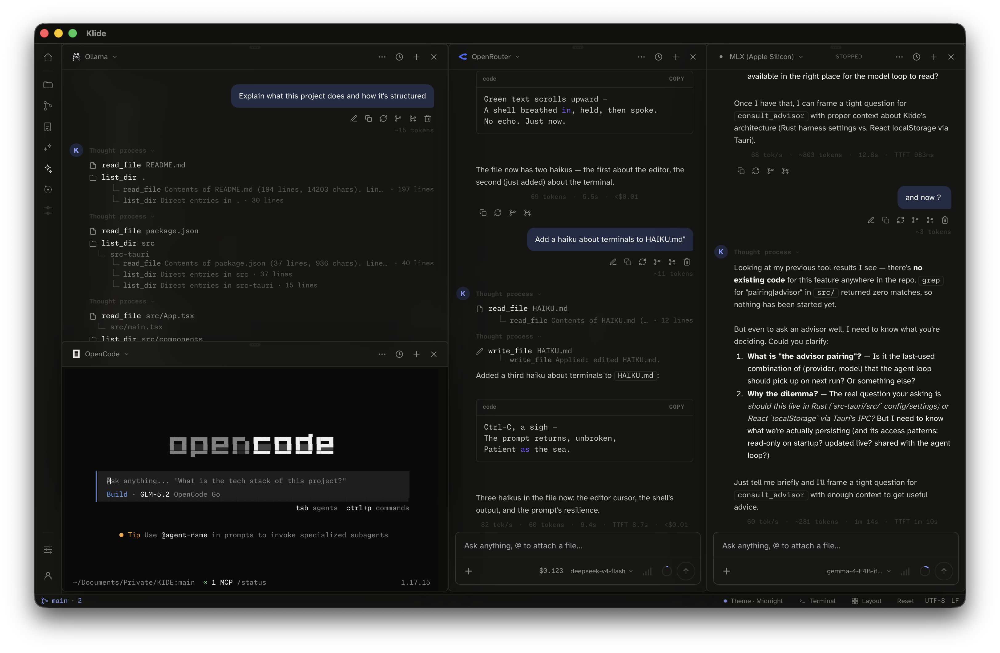

<div align="center">

# Klide

### Every agent visible. Every change reviewable.

A local-first coding workspace for running local models and subscription coding agents side by side.

<br/>


[](./LICENSE)

<br/>

[**Get started**](#get-started) &nbsp;·&nbsp; [Features](#features) &nbsp;·&nbsp; [Architecture](#trust-and-architecture) &nbsp;·&nbsp; [Contributing](#contributing)

<br/>



</div>

## One workspace for every coding agent

Klide runs Ollama, MLX, Claude Code, Codex, OpenCode, and Oh My Pi (OMP) without hiding their native capabilities. You can inspect tool calls, follow terminal output, compare model cost and latency, and review changes from one workspace.

Klide keeps three questions in view:

- **What is running?** Mission Control tracks Klide runs and delegate command-line interface (CLI) sessions
- **What needs attention?** Waiting, blocked, failed, and reviewable work rises to the top
- **What changed?** Each run keeps its files, branch, transcript, validation state, cost, and memory evidence

## Why Klide

Coding agents work well in terminals, but their sessions, diffs, and evidence spread across separate tools. Klide keeps the real terminal experience and adds a shared operations layer around it.

| | |
|---|---|
| **Run real agents** | Use Claude Code, Codex, OpenCode, OMP, or a custom CLI inside persistent pseudoterminal (PTY) sessions |
| **Keep work visible** | See working, waiting, blocked, and completed runs across the workspace |
| **Review before trust** | Approve commands, inspect proposed edits, comment on diffs, and check validation evidence |
| **Choose where inference runs** | Start with Ollama or MLX, then opt into hosted providers or subscription CLIs |
| **Resume with context** | Reopen transcripts, hand work to another agent, and save reviewed project memory |

## How work moves through Klide

1. Start a Klide run or open a delegate CLI
2. Follow its status, tool calls, terminal output, and changed files
3. Review edits and commands before they cross the workspace trust boundary
4. Validate the result, send feedback, resume later, or hand the work to another agent

Klide has three capability modes:

| Mode | Agent access |
|---|---|
| `Chat` | Answers without workspace tools |
| `Plan` | Reads the workspace and proposes an approach |
| `Goal` | Uses tools with diff review and permission-gated commands |

## Features

| Area | Included |
|---|---|
| **Agent operations** | Mission Control, shared run lifecycle, attention queue, transcripts, session resume, cross-agent handoff, sub-agent visibility |
| **Review and evidence** | Diff comments sent to agents, command approval, checkpoints, validation status, files touched, tokens, cost, and stop reasons |
| **Parallel work** | Git worktrees, worktree setup recipes, agent races on the same task, evidence comparison, and merge controls |
| **Editor and shell** | Monaco editor, file explorer, tabs, search, command palette, Git review, commit graph, and persistent PTY terminals |
| **Models** | Ollama, MLX, Anthropic, OpenAI, Mistral, xAI, OpenRouter, and OpenAI-compatible endpoints |
| **Project context** | `AGENTS.md`, `CLAUDE.md`, file mentions, skills, dynamic tools, and reviewed project memory |
| **Local security** | Workspace-rooted file access, operating-system keychain storage, project command allowlists, and network permissions |

## Get started

Klide currently targets macOS. Apple Silicon is the primary development platform.

### Download the unsigned Apple Silicon build

Download the latest `.app.zip` from [GitHub Releases](https://github.com/pierreprudh/KLIDE/releases/latest), unzip it, and move `Klide.app` to Applications.

This build is ad-hoc signed and is not Apple-notarized. On first launch, macOS may block it because the developer cannot be verified. Control-click `Klide.app`, choose **Open**, then confirm **Open**. Only install builds published from this repository.

### Prerequisites

- [Node.js](https://nodejs.org) 20 or later
- [Rust](https://rustup.rs) stable
- Optional: [Ollama](https://ollama.com) or [`mlx-lm`](https://github.com/ml-explore/mlx-lm) for local inference

### Build from source

Clone the repository and start the Tauri development build:

```bash
git clone https://github.com/pierreprudh/KLIDE.git
cd KLIDE
npm install
npm run tauri dev
```

The first Rust build takes about three to five minutes. Later builds reuse the compiled dependencies.

Once Klide opens:

1. Open a workspace folder
2. Open the AI panel and select a provider
3. Press `Tab` to switch between `Chat`, `Plan`, and `Goal`
4. Open Mission Control to follow active and completed work

`⌘P` jumps to a file, `⌘⇧P` opens the command palette, and `⌘/` shows the full shortcut cheatsheet.

## Use the Klide model

[`pierreprudh/klide-8b`](https://ollama.com/pierreprudh/klide-8b) is a Low-Rank Adaptation (LoRA) fine-tune of LFM2.5-8B-A1B. It is trained for Klide's tool and edit contract.

```bash
ollama pull pierreprudh/klide-8b
```

The model appears in Klide's Ollama picker after the download finishes.

## Trust and architecture

Klide separates the interface from the durable execution layer:

| Layer | Responsibility |
|---|---|
| **React and TypeScript** | Editor, panels, review surfaces, layouts, and run projections |
| **Tauri and Rust** | Agent harness, provider streaming, tools, permissions, PTYs, Git, keychain, and filesystem access |
| **JSON Lines (JSONL) transcripts** | Append-only run events used by Mission Control, validation, memory, and replay |

The Rust harness checks capabilities when it advertises tools and again before execution. Writes pause for diff review. Commands and network access pause for permission.

Read the [Harness contract](./HARNESS_CONTRACT.md) for the trust model and [Harness schema](./KLIDE_HARNESS_SCHEMA.md) for the tool interface.

## Project status

Klide v0.5 is feature-complete and remains under active development. Its frontend tests, production build, Rust suite, PTY socket integration, and release-bundle boot check pass. Unsigned Apple Silicon bundles and source builds are available now; Apple-notarized bundles are not yet published.

Current priorities:

- v0.5.1: dogfood race/restart/merge behavior, default worktree isolation, and historical Delegate lifecycle signals
- v0.5.1: publish a signed/notarized macOS build, then validate Windows and Linux
- v0.6: make Missions, budgets, capacity, routing, and validation contracts one dependable orchestration layer

See the [changelog](./CHANGELOG.md) for shipped milestones.

## Development

Run the relevant checks before submitting a change:

```bash
npm test
npm run build
cargo test --manifest-path src-tauri/Cargo.toml
```

The frontend lives in `src/`. The Rust backend lives in `src-tauri/`.

## Contributing

Issues and pull requests are welcome. Keep changes focused, preserve the workspace trust boundary, and include validation for changed behavior.

## Acknowledgments

Klide is built with [Tauri](https://v2.tauri.app), [Monaco](https://microsoft.github.io/monaco-editor/), and [xterm.js](https://xtermjs.org). Its product influences include Sinew, Ara, Cursor, Cline, Linear, and the open coding-agent ecosystem.

## License

Klide is available under the [MIT License](./LICENSE).
