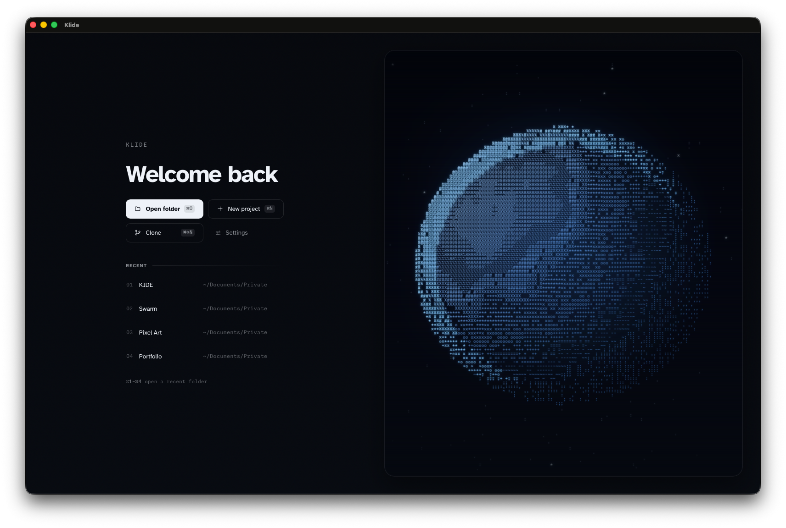

<div align="center">

# Klide

### Every agent visible. Every change reviewable.

A local-first coding workspace for running local models and subscription coding agents side by side.

<br/>


[](./LICENSE)

<br/>

[**Get started**](#get-started) &nbsp;·&nbsp; [Features](#features) &nbsp;·&nbsp; [Architecture](#trust-and-architecture) &nbsp;·&nbsp; [Contributing](#contributing)

</div>

## One workspace for every coding agent

Klide runs Ollama, MLX, Claude Code, Codex, OpenCode, and Oh My Pi (OMP) without hiding their native capabilities. You can inspect tool calls, follow terminal output, compare model cost and latency, and review changes from one workspace.

Klide keeps three questions in view:

- **What is running?** Mission Control tracks Klide runs and delegate command-line interface (CLI) sessions
- **What needs attention?** Waiting, blocked, failed, and reviewable work rises to the top
- **What changed?** Each run keeps its files, branch, transcript, validation state, cost, and memory evidence

## Three ways to work

Klide opens on the surface that matches the task, and all three share the same runs, transcripts, and review state.

### Welcome — start or resume a project

Recent folders, clone, and new project on one quiet screen. `⌘1`–`⌘5` reopen a recent workspace without touching the mouse.



### Focus — one task, one conversation

A rail of projects, providers, and past conversations on the left; a single centered conversation in the middle. Resume any thread, see the branch you are on, and keep the Git strip in the corner.


### Free mode — every agent on one canvas

Floating, resizable panels over the editor. Run several providers and delegate CLIs side by side, compare their answers, and keep the file you are reviewing open behind them.


## Why Klide

Coding agents work well in terminals, but their sessions, diffs, and evidence spread across separate tools. Klide keeps the real terminal experience and adds a shared operations layer around it.

| | |
|---|---|
| **Run real agents** | Use Claude Code, Codex, OpenCode, OMP, or a custom CLI inside persistent pseudoterminal (PTY) sessions |
| **Keep work visible** | See working, waiting, blocked, and completed runs across the workspace |
| **Review before trust** | Approve commands, inspect proposed edits, comment on diffs, and check validation evidence |
| **Choose where inference runs** | Start with Ollama or MLX, then opt into hosted providers or subscription CLIs |
| **Resume with context** | Reopen transcripts, hand work to another agent, and save reviewed project memory |

## How work moves through Klide

1. Start a Klide run or open a delegate CLI
2. Follow its status, tool calls, terminal output, and changed files
3. Review edits and commands before they cross the workspace trust boundary
4. Validate the result, send feedback, resume later, or hand the work to another agent

Klide has three capability modes:

| Mode | Agent access |
|---|---|
| `Chat` | Answers without workspace tools |
| `Plan` | Reads the workspace and proposes an approach |
| `Goal` | Uses tools with diff review and permission-gated commands |

## Features

| Area | Included |
|---|---|
| **Agent operations** | Mission Control, shared run lifecycle, attention queue, transcripts, session resume, cross-agent handoff, sub-agent visibility |
| **Agent coordination** | One Rust-owned journal: runs address each other by a stable id, delegate CLIs join through an embedded MCP server, and another agent's words are reviewed before they reach a conversation |
| **Documents** | Native workbook tools that create and revise a recalculated `.xlsx` through the normal review path, plus a built-in sheet surface for `.xlsx` and `.sheet.json` |
| **Review and evidence** | Diff comments sent to agents, command approval, checkpoints, validation status, files touched, tokens, cost, and stop reasons |
| **Parallel work** | Git worktrees, worktree setup recipes, agent races on the same task, evidence comparison, and merge controls |
| **Editor and shell** | Monaco editor, file explorer, tabs, search, command palette, Git review, commit graph, and persistent PTY terminals |
| **Workspace surfaces** | Welcome launcher, focus mode, free-mode floating panels, fixed layout presets, and a freeform grid builder |
| **Models** | Ollama, MLX, Anthropic, OpenAI, Mistral, xAI, DeepSeek, OpenRouter, and OpenAI-compatible endpoints |
| **Project context** | `AGENTS.md`, `CLAUDE.md`, file mentions, image and document attachments, skills, dynamic tools, search over previous conversations, and native recall over reviewed Project Memory with provenance |
| **Local security** | Workspace-rooted file access, operating-system keychain storage, project command allowlists, network permissions, and a user-choosable transcript folder |

## Get started

Klide currently targets macOS. Apple Silicon is the primary development platform.

### Download the unsigned Apple Silicon build

Download the newest `.app.zip` attached to a release on [GitHub Releases](https://github.com/pierreprudh/KLIDE/releases), unzip it, and move `Klide.app` to Applications. Not every patch release ships a bundle — take the most recent release that has one.

This build is ad-hoc signed and is not Apple-notarized. On first launch, macOS may block it because the developer cannot be verified. Control-click `Klide.app`, choose **Open**, then confirm **Open**. Only install builds published from this repository.

### Prerequisites

- [Node.js](https://nodejs.org) 20 or later
- [Rust](https://rustup.rs) stable
- Optional: [Ollama](https://ollama.com) or [`mlx-lm`](https://github.com/ml-explore/mlx-lm) for local inference

### Build from source

Clone the repository and start the Tauri development build:

```bash
git clone https://github.com/pierreprudh/KLIDE.git
cd KLIDE
npm install
npm run tauri dev
```

The first Rust build takes about three to five minutes. Later builds reuse the compiled dependencies.

Once Klide opens:

1. Open a workspace folder
2. Open the AI panel and select a provider
3. Press `Tab` to switch between `Chat`, `Plan`, and `Goal`
4. Open Mission Control to follow active and completed work

`⌘P` jumps to a file, `⌘⇧P` opens the command palette, and `⌘/` shows the full shortcut cheatsheet.

## Use the Klide model

[`pierreprudh/klide-8b`](https://ollama.com/pierreprudh/klide-8b) is a Low-Rank Adaptation (LoRA) fine-tune of LFM2.5-8B-A1B. It is trained for Klide's tool and edit contract.

```bash
ollama pull pierreprudh/klide-8b
```

The model appears in Klide's Ollama picker after the download finishes.

## Trust and architecture

Klide separates the interface from the durable execution layer:

| Layer | Responsibility |
|---|---|
| **React and TypeScript** | Editor, panels, review surfaces, layouts, and run projections |
| **Tauri and Rust** | Agent harness, provider streaming, tools, permissions, PTYs, Git, keychain, and filesystem access |
| **JSON Lines (JSONL) transcripts** | Append-only run events used by Mission Control, validation, memory, and replay |

The Rust harness checks capabilities when it advertises tools and again before execution. Writes pause for diff review. Commands and network access pause for permission.

Read the [Harness contract](./docs/HARNESS_CONTRACT.md) for the trust model and [Harness schema](./docs/KLIDE_HARNESS_SCHEMA.md) for the tool interface.
The [Memory Engine](./docs/MEMORY_ENGINE.md) and [Project Memory schema](./docs/KLIDE_MEMORY_SCHEMA.md) describe Klide's local learning layer and its future embedded-MCP boundary.
The [Agent Coordination architecture](./docs/AGENT_COORDINATION.md) and [coordination schemas](./docs/KLIDE_COORDINATION_SCHEMA.md) define stable Run addressing, durable envelopes, replay, and the shared adapter boundary for native agents and Delegates.

## Project status

Klide is under active development. Its frontend tests, production build, Rust suite, PTY socket integration, and release-bundle boot check pass. Unsigned Apple Silicon bundles and source builds are available now; Apple-notarized bundles are not yet published.

v0.6.3 — Coordination and Documents is the current release (2026-09-12). Runs can address each other through one Rust-owned journal — Klide's own conversations and the delegate CLIs alike, the latter through an embedded MCP server — and no agent's words reach a conversation without its operator reviewing them. A run can also produce a real document instead of describing one: it writes and revises an `.xlsx` that Klide recalculates and opens in a built-in sheet surface.

The two cuts before it are on the same line. v0.6.2 — Memory, Routing, Recovery gave the agent native recall over reviewed Project Memory, resolved the `auto` model choice once in Rust at run start, and made a run near the turn cap finish instead of erroring. v0.6.1 — Subscriptions and Reach let Focus use every provider Klide supports, ran delegate CLIs there on their own subscription, and added around forty upstreams behind the opencodex gateway.

The v0.6 orchestration milestone itself — Missions as outcomes, budget and capacity in the dispatch path, capability routing, automatic validation contracts — is still open, so treat those surfaces as unfinished.

Current priorities:

- v0.5.1: dogfood the full race/restart/permission/merge/cleanup path
- v0.5.1: publish a signed/notarized macOS build, then validate Windows and Linux
- v0.6: make Missions, budgets, capacity, routing, and validation contracts one dependable orchestration layer

See the [changelog](./CHANGELOG.md) for shipped milestones.

## Development

Run the relevant checks before submitting a change:

```bash
npm test
npm run build
cargo test --manifest-path src-tauri/Cargo.toml
```

The frontend lives in `src/`. The Rust backend lives in `src-tauri/`.

## Contributing

Issues and pull requests are welcome. Keep changes focused, preserve the workspace trust boundary, and include validation for changed behavior.

## Acknowledgments

Klide is built with [Tauri](https://v2.tauri.app), [Monaco](https://microsoft.github.io/monaco-editor/), and [xterm.js](https://xtermjs.org). Its product influences include Sinew, Ara, Cursor, Cline, Linear, and the open coding-agent ecosystem.

## License

Klide is available under the [MIT License](./LICENSE).
