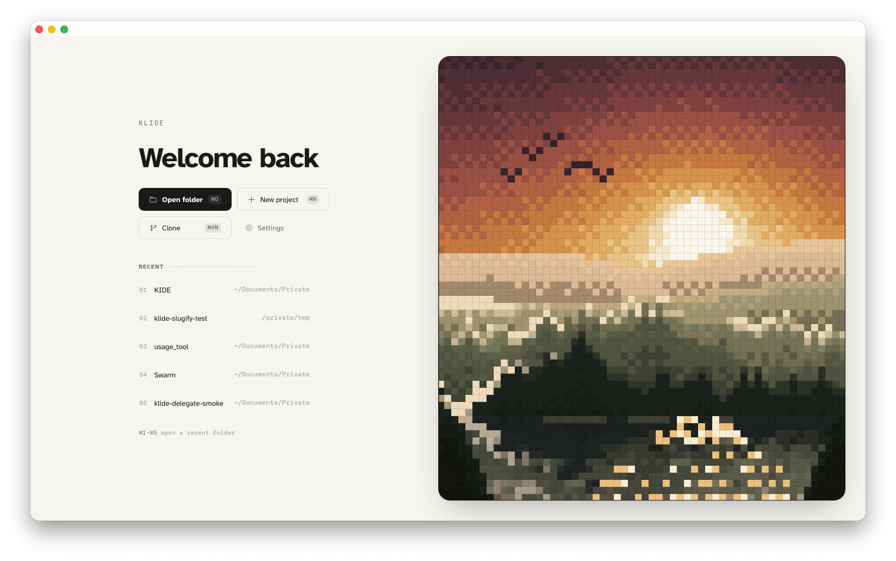
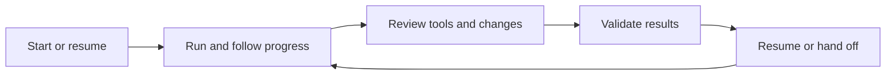
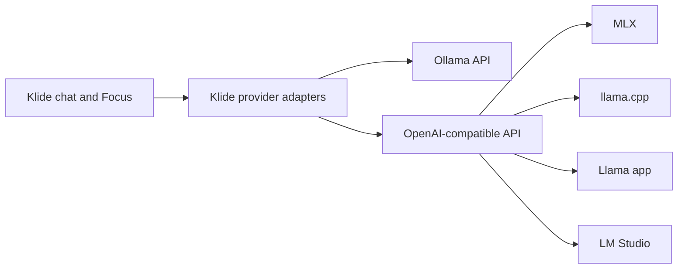

<div align="center">

# Klide

### Every agent visible. Every change reviewable.

A local-first coding workspace for running local models and subscription coding agents side by side.

<br/>


[](./LICENSE)

<br/>

[**Get started**](#get-started) &nbsp;·&nbsp; [Features](#features) &nbsp;·&nbsp; [Architecture](#trust-and-architecture) &nbsp;·&nbsp; [Contributing](#contributing)

</div>

## One workspace for every coding agent

Klide runs Ollama, MLX, Claude Code, Codex, OpenCode, and Oh My Pi (OMP) without hiding their native capabilities. You can inspect tool calls, follow terminal output, compare model cost and latency, and review changes from one workspace.

Klide keeps three questions in view:

- **What is running?** Mission Control tracks Klide runs and delegate command-line interface (CLI) sessions
- **What needs attention?** Waiting, blocked, failed, and reviewable work rises to the top
- **What changed?** Each run keeps its files, branch, transcript, validation state, cost, and memory evidence

## Three ways to work

Klide opens on the surface that matches the task, and all three share the same runs, transcripts, and review state.

### Welcome — start or resume a project

Open a folder, start a new project, or clone a repository from one quiet page, with your recent workspaces numbered underneath. `⌘O`, `⌘N`, and `⌘⇧N` reach the three actions, and `⌘1`–`⌘5` reopen a recent workspace without touching the mouse. Beside the list, a framed big-pixel nature film drifts through five scenes; it holds a single still when the system asks for reduced motion.



### Focus — one task, one conversation

A rail of projects, providers, and past conversations on the left; a single centered conversation in the middle. Resume any thread, see the branch you are on, and keep the Git strip in the corner.


### Free mode — every agent on one canvas

Floating, resizable panels over the editor. Run several providers and delegate CLIs side by side, compare their answers, and keep the file you are reviewing open behind them.


## Why Klide

Coding agents work well in terminals, but their sessions, diffs, and evidence spread across separate tools. Klide keeps the real terminal experience and adds a shared operations layer around it.

| | |
|---|---|
| **Run real agents** | Use Claude Code, Codex, OpenCode, OMP, or a custom CLI inside persistent pseudoterminal (PTY) sessions |
| **Keep work visible** | See working, waiting, blocked, and completed runs across the workspace |
| **Review before trust** | Approve commands, inspect proposed edits, comment on diffs, and check validation evidence |
| **Choose where inference runs** | Start with Ollama or MLX, then opt into hosted providers or subscription CLIs |
| **Resume with context** | Reopen transcripts, hand work to another agent, and save reviewed project memory |

## How work moves through Klide


```mermaid
flowchart LR
    Start[Start or resume] --> Run[Run and follow progress]
    Run --> Review[Review tools and changes]
    Review --> Check[Validate results]
    Check --> Next[Resume or hand off]
    Next --> Run
```

Klide has three capability modes:

| Mode | Agent access |
|---|---|
| `Chat` | Answers without workspace tools |
| `Plan` | Reads the workspace and proposes an approach |
| `Goal` | Uses tools with diff review and permission-gated commands |

## Features

| Area | Included |
|---|---|
| **Agent operations** | Mission Control, shared run lifecycle, attention queue, transcripts, session resume, cross-agent handoff, sub-agent visibility |
| **Agent coordination** | One Rust-owned journal: runs address each other by a stable id, delegate CLIs join through an embedded MCP server, each Delegate session proves itself with its own secret, and another agent's words arrive in one fenced delivery, reviewed before they reach a conversation |
| **Connectors** | The MCP servers you already configured in Claude Code, Codex, or OpenCode, local or remote; the assistant calls them in Plan and Goal (reads free, writes gated per tool), and GitHub connects in one click as the pinned account |
| **Background work** | Background shells a Run can read, stop, or be woken by; GitHub CI observer cards that follow a pinned run and open its PR in Git Review; subscription conversations that keep running after the app quits |
| **Workers** | `spawn_subagent` hands a task to a Delegate CLI as an approved, isolated Run of its own, watched live from the parent conversation |
| **Documents** | Native workbook tools that create and revise a recalculated `.xlsx` through the normal review path, plus a built-in sheet surface for `.xlsx` and `.sheet.json` |
| **Review and evidence** | Diff comments sent to agents, command approval, per-mode tool toggles enforced at dispatch, checkpoints, validation status, files touched, tokens, cost, and stop reasons |
| **Parallel work** | Git worktrees, worktree setup recipes, agent races on the same task, evidence comparison, and merge controls |
| **Editor and shell** | Monaco editor with eight themes, file explorer, tabs, search, command palette, Git review, commit graph, and persistent PTY terminals |
| **Workspace surfaces** | Welcome launcher, focus mode, free-mode floating panels, fixed layout presets, and a freeform grid builder |
| **Models** | Ollama, MLX, Anthropic, OpenAI, Mistral, xAI, DeepSeek, OpenRouter, OpenAI-compatible endpoints, about forty more behind the opencodex gateway, and `auto` resolved once in Rust at run start |
| **Delegate CLIs** | Claude Code, Codex, OpenCode, and OMP in persistent PTYs or as streaming Focus turns; each CLI's own `/` commands in the composer, Claude Code's reasoning effort levels, `/config` drawn as a settings card, version and updater per CLI, and per-login usage in the account menu |
| **Project context** | `AGENTS.md`, `CLAUDE.md`, file mentions, image and document attachments, skills, dynamic tools, search over previous conversations, native recall over reviewed Project Memory with provenance, and `html` / `svg` visuals drawn in the answer |
| **From other apps** | `klide://` links open a pre-filled conversation, a file at a line, or a project; Ask Kit in the macOS Services menu sends selected text to a new conversation |
| **Local security** | Workspace-rooted file access, operating-system keychain storage, project command allowlists, network permissions, a user-choosable transcript folder with measured cleanup, and Rust deciding what a run may open, reveal, or must refuse |

## Get started

Klide currently targets macOS. Apple Silicon is the primary development platform.

### Download the unsigned Apple Silicon build

Download the newest `.app.zip` attached to a release on [GitHub Releases](https://github.com/pierreprudh/KLIDE/releases), unzip it, and move `Klide.app` to Applications. Not every patch release ships a bundle — take the most recent release that has one.

This build is ad-hoc signed and is not Apple-notarized, and Klide is distributed through GitHub Releases only — there is no App Store listing and no notarization ticket. A file your browser downloads carries a quarantine flag, so on first launch macOS blocks it: *"Klide.app cannot be opened because Apple cannot check it for malicious software."*

Two ways past it. Open **System Settings › Privacy & Security**, scroll to Security, and click **Open Anyway** next to the blocked app — on macOS 15 and later this is the supported route, since Control-click › Open no longer bypasses the check. Or clear the flag yourself before launching:

```bash
xattr -dr com.apple.quarantine /Applications/Klide.app
```

Only do this for builds published from this repository. Notarization — which removes the prompt entirely — is deliberately deferred while distribution stays GitHub-only; see `TODO.md`.

### Prerequisites

- [Node.js](https://nodejs.org) 20 or later
- [Rust](https://rustup.rs) stable
- Optional: [Ollama](https://ollama.com) or [`mlx-lm`](https://github.com/ml-explore/mlx-lm) for local inference

### Build from source

Clone the repository and start the Tauri development build:

```bash
git clone https://github.com/pierreprudh/KLIDE.git
cd KLIDE
npm install
npm run tauri dev
```

The first Rust build takes about three to five minutes. Later builds reuse the compiled dependencies.

Once Klide opens:

1. Open a workspace folder
2. Open the AI panel and select a provider
3. Press `Tab` in the composer to switch between `Plan` and `Work`
4. Open Mission Control to follow active and completed work

`⌘P` jumps to a file, `⌘⇧P` opens the command palette, and `⌘/` shows the full shortcut cheatsheet.

One task, end to end:

1. Open a folder, open the AI panel, and select `Ollama` in the provider selector
2. Leave the composer's `+` menu on `Work` — the default — or press `Tab` to reach `Plan`
3. Describe the change and press `↵`
4. The mode note under the composer reads `reviewing edits`: `Validate` applies the edit, `Cancel` drops it, and `⤢` opens the changes in the editor
5. Press `⌘⇧G` to see the applied edit in `Git Review`, or open `Mission Control` to follow the run

## Use the Klide model

[`pierreprudh/klide-8b`](https://ollama.com/pierreprudh/klide-8b) is a Low-Rank Adaptation (LoRA) fine-tune of LFM2.5-8B-A1B. It is trained for Klide's tool and edit contract.

```bash
ollama pull pierreprudh/klide-8b
```

The model appears in Klide's Ollama picker after the download finishes.

## Local inference

### Providers

| Provider | Setup | Endpoint | Managed by |
| --- | --- | --- | --- |
| Ollama | Install Ollama; select a downloaded model in Klide | `localhost:11434` | Klide can start and stop the server |
| MLX-LM 0.31.3¹ | Install `mlx-lm`; start from Local Servers settings | `localhost:8080` | Klide can start and stop the server |
| llama.cpp | Choose a model in Local Servers settings; install and start in one action | `localhost:8081` | Klide |
| [Llama app](https://llama.app) | **Llama → Llama app → Get Llama** in Local Servers settings; choose a model in Llama, then select it in Klide | `localhost:9931/v1` | Llama app; Klide discovers its models |
| LM Studio | Start its local server; select LM Studio in Klide | `localhost:1234/v1` | LM Studio |

Llama app discovers the shared GGUF cache. Set its model context to at least **16k**
for Klide’s tool prompts; its automatic 4k choice for the tested 3B model was too small.
Klide-managed llama.cpp starts with 16k context.
See the [live setup and tool smoke test](scripts/local-inference/results/SMOKE.md)
for verified behavior and the tested small model’s limitations.

Local Servers groups both llama.cpp setups under **Llama**, with a **Klide / Llama app**
switch. It remembers the selection and shows only that Llama setup in the AI and Focus provider selectors.
Switching the setup does not start or stop a server or change existing conversations.

### Connection flow


```mermaid
flowchart LR
    UI[Klide chat and Focus] --> Adapter[Klide provider adapters]
    Adapter --> Ollama[Ollama API]
    Adapter --> OpenAI[OpenAI-compatible API]
    OpenAI --> MLX[MLX]
    OpenAI --> CPP[llama.cpp]
    OpenAI --> Llama[Llama app]
    OpenAI --> Studio[LM Studio]
```

Choose the provider in Klide, then choose a model available through that server.

### llama.cpp models

| Model | Quantization | Download | Estimated memory at 16k context |
| --- | --- | ---: | ---: |
| [Klide 8B](https://ollama.com/pierreprudh/klide-8b) | Q8_0 | 9.01 GB | 12.5 GB |
| [Qwen3 8B](https://huggingface.co/Qwen/Qwen3-8B-GGUF) | Q4_K_M | 5 GB | 8 GB |
| [Llama 3.2 3B](https://huggingface.co/bartowski/Llama-3.2-3B-Instruct-GGUF) | Q4_K_M | 2.02 GB | 4 GB |
| [Ministral 3 3B](https://huggingface.co/mistralai/Ministral-3-3B-Instruct-2512-GGUF) | Q4_K_M | 2.15 GB | 4.5 GB |

Klide detects the chip, RAM and CPU cores to recommend a model, favouring smaller
models on CPU. Memory figures estimate fit, not speed; other apps reduce available memory.

| Setup detail | Behavior |
| --- | --- |
| Installation | Download only llama.cpp, or install and start the selected model in one action; no Homebrew or administrator password needed |
| Runtime | Official release with verified checksum in `~/.klide/runtimes/llamacpp`; an existing `llama-server` on PATH is reused |
| Models | Cached after download; Klide's Q8 GGUF comes from its Ollama registry layer with a pinned SHA-256 check |
| Selection | Saved in `~/.klide/llamacpp.json`, shared by chat and Focus; stop before changing models |
| Server ownership | Stop terminates Klide-launched servers; external servers must be stopped externally |
| Platforms | Automatic runtime installation supports macOS; other platforms need an installed `llama-server` |

### Provider benchmark

**No clear performance advantage from switching engines was demonstrated.**

| Measurement setup | Value |
| --- | --- |
| Date and machine | 2026-10-06; Apple M5, 16 GB RAM, Metal |
| Model | Identical Klide 8.5B Q8_0 GGUF |
| Settings | Context 8,192; output cap 256; temperature 0; seed 42; thinking disabled |
| Method | Median of three post-warmup trials through Klide's streaming adapters; one engine loaded at a time; loading excluded |

| Task | Ollama 0.35.1 | llama.cpp 8950 | MLX-LM 0.31.3¹ | Result |
| --- | ---: | ---: | --- | --- |
| Requested `read_file` call | 282 ms | 299 ms | 2,477 ms | Ollama/llama.cpp: 3/3 structured calls; MLX: correct call as text, 0/3 structured calls |
| Short explanation | 338 ms | 323 ms | 5,387 ms | Ollama/llama.cpp: unwanted tool call; MLX: reasoning only at token cap |
| Long project summary | 289 ms | 271 ms | 5,947 ms | Ollama/llama.cpp: unwanted tool call; MLX: reasoning only at token cap |

¹ MLX used **LFM2.5-8B-A1B MLX 8-bit + the local Klide checkpoint 1400 LoRA**,
not the merged Q8_0 GGUF. It emitted reasoning despite the thinking-disable request.
These are observed request timings, **not a controlled three-engine speed ranking**.
All MLX trials completed without HTTP errors; plain-text tasks produced no final
answer within 256 tokens. The tool task emitted the correct pythonic call as text,
not a structured `toolCalls` entry. This test does not establish full-harness tool failure.
MLX had no enforced 8k context cap; the largest prompt used 2,859 tokens.
The benchmark requested streamed usage for accounting; normal Klide MLX settings leave it off.

| Interpretation | Limit |
| --- | --- |
| Tool latency | llama.cpp was about 6% slower in this small sample; insufficient to rank engines generally |
| Failed text tasks | Timings do not represent useful text generation; model/prompt behavior needs investigation |
| Tool parsing without supplied tools | llama.cpp exposed tool syntax as text; Ollama parsed it as a tool call |
| Scope | Adapter benchmark; no full coding-agent workflow or workspace tool execution |
| Comparability | Repeated prompts benefit from caching; tool templates yield different token counts; results depend on hardware and settings |
| MLX comparison | Measured with cached LFM2.5-8B-A1B MLX 8-bit weights plus local Klide checkpoint 1400; published GGUF equivalence unverified |
| Other unmeasured providers | LM Studio and Llama app |

| Evidence | Link |
| --- | --- |
| Full report | [Method and limitations](scripts/local-inference/results/REPORT.md) |
| Raw trials | [Ollama](scripts/local-inference/results/ollama.json) · [llama.cpp](scripts/local-inference/results/llamacpp.json) · [MLX](scripts/local-inference/results/mlx.json) |
| Reproduction | [Commands and prerequisites](scripts/local-inference/README.md) |

## Trust and architecture

Klide separates the interface from the durable execution layer:

| Layer | Responsibility |
|---|---|
| **React and TypeScript** | Editor, panels, review surfaces, layouts, and run projections |
| **Tauri and Rust** | Agent harness, provider streaming, tools, permissions, PTYs, Git, keychain, and filesystem access |
| **JSON Lines (JSONL) transcripts** | Append-only run events used by Mission Control, validation, memory, and replay |

The Rust harness checks capabilities when it advertises tools and again before execution. Writes pause for diff review. Commands and network access pause for permission.

Read the [Harness contract](./docs/HARNESS_CONTRACT.md) for the trust model and [Harness schema](./docs/KLIDE_HARNESS_SCHEMA.md) for the tool interface.
The [Memory Engine](./docs/MEMORY_ENGINE.md) and [Project Memory schema](./docs/KLIDE_MEMORY_SCHEMA.md) describe Klide's local learning layer and its future embedded-MCP boundary.
The [Agent Coordination architecture](./docs/AGENT_COORDINATION.md) and [coordination schemas](./docs/KLIDE_COORDINATION_SCHEMA.md) define stable Run addressing, durable envelopes, replay, and the shared adapter boundary for native agents and Delegates.

## Project status

Klide is under active development. Its frontend tests, production build, Rust suite, PTY socket integration, and release-bundle boot check pass. Unsigned Apple Silicon bundles and source builds are available now. Distribution is GitHub Releases only and the bundle is ad-hoc signed; notarization is deferred by choice, so first launch needs one pass through Privacy & Security.

Since v0.6.5, main has gained the following, each under the name it shipped with:

- **GitHub observer cards** — a `gh run watch` becomes a live CI card in the conversation and the Focus side panel; it names failed checks and opens the PR in Git Review
- **Claude Code effort** — low to max reasoning effort for terminal and Focus turns
- **Connectors: the assistant can call them, GitHub connects in one click** — reads run as asked, writes ask per tool; remote servers and `${VAR}` references work
- **Each CLI's own commands in the `/` menu** — Claude Code, OpenCode, and Oh My Pi bring theirs, and Claude Code's `/config` answer is drawn as a settings card
- **`klide://` links and Ask Kit in the Services menu** — Raycast, Shortcuts, a terminal, or selected text in any app opens a pre-filled conversation, a file at a line, or a project
- **Keep subscription conversations running after app exit** — the turn finishes in the background host and reattaches on reopen; Settings → Storage lists and cleans saved conversations
- **OpenCode turns type out as they're written** — streamed from `opencode serve` instead of landing in one block
- **Account menu: usage per CLI** — each login shows its session and weekly allowance, with account switching
- **Cerulean theme**, an **editor dock with a clean full-height top**, and a composer that grows for a long paste behind one provider-picker design
- **Settings → Harness → Tools per mode now takes effect** — a turned-off Tool is neither offered nor dispatched

Underneath, the September architecture review landed as nine merged pull requests: **one Gate subject** every permission check reads, **a Run lease** that releases everything it holds however the loop ends, **one fenced delivery** for everything the operator did not type, **a per-session bridge secret** for Delegate CLIs, **a real CSS tokenizer** in the visual sanitizer, **Rust deciding Open / Reveal / Refuse** for documents, **one process module** for every command a Run starts, **the Mission supervisor as the only dispatcher**, and **a coordination journal store that is safe across processes**.

v0.6.8 — Sight and Recovery (2026-10-07) adds image descriptions for models without vision, shared run management and crash cleanup, a calmer Memory window, terminal environment-aware agent commands, and local inference improvements.

v0.6.4 — Workers, Connectors, Visuals (2026-09-20) precedes it. A Harness Run can hand a task to another CLI agent as a worker — a dispatch the operator approves, an isolated worktree, a Run of its own — instead of shelling out to `claude -p`. Klide connects to the MCP servers already configured in the tools you use. And an answer can draw: an `html` or `svg` fence renders as a sanitized, themed picture in the conversation.

The cuts before it are on the same line. v0.6.3 — Coordination and Documents let Runs address each other through one Rust-owned journal, with every agent's words reviewed before they reach a conversation, and let a run write a real `.xlsx` that Klide recalculates and opens. v0.6.2 — Memory, Routing, Recovery gave the agent native recall over reviewed Project Memory, resolved the `auto` model choice once in Rust at run start, and made a run near the turn cap finish instead of erroring. v0.6.1 — Subscriptions and Reach let Focus use every provider Klide supports, ran delegate CLIs there on their own subscription, and added around forty upstreams behind the opencodex gateway.

The v0.6 orchestration milestone itself — Missions as outcomes, budget and capacity in the dispatch path, capability routing, automatic validation contracts — is still open, so treat those surfaces as unfinished.

Current priorities:

- Next cut: dogfood Sight image drops and background run recovery; continue the v0.6 patch line.
- v0.5.1: dogfood the full race/restart/permission/merge/cleanup path
- v0.5.1: publish a signed/notarized macOS build, then validate Windows and Linux
- v0.6: make Missions, budgets, capacity, routing, and validation contracts one dependable orchestration layer

See the [changelog](./CHANGELOG.md) for shipped milestones.

## Development

Run the relevant checks before submitting a change:

```bash
npm test
npm run build
cargo test --manifest-path src-tauri/Cargo.toml
```

The frontend lives in `src/`. The Rust backend lives in `src-tauri/`.

## Contributing

Issues and pull requests are welcome. Keep changes focused, preserve the workspace trust boundary, and include validation for changed behavior.

## Acknowledgments

Klide is built with [Tauri](https://v2.tauri.app), [Monaco](https://microsoft.github.io/monaco-editor/), and [xterm.js](https://xtermjs.org). Its product influences include Ara, Cursor, Cline, Linear, and the open coding-agent ecosystem.

## License

Klide is available under the [MIT License](./LICENSE).
