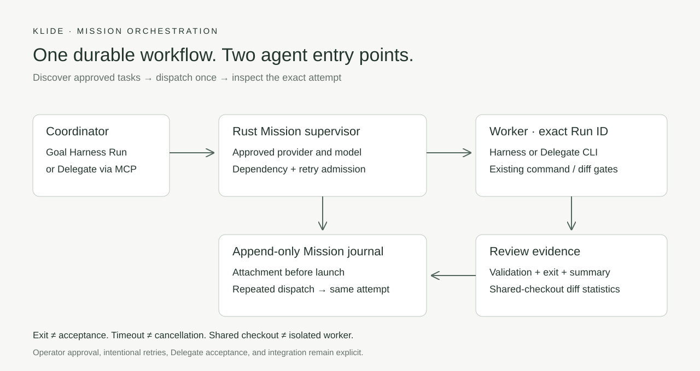
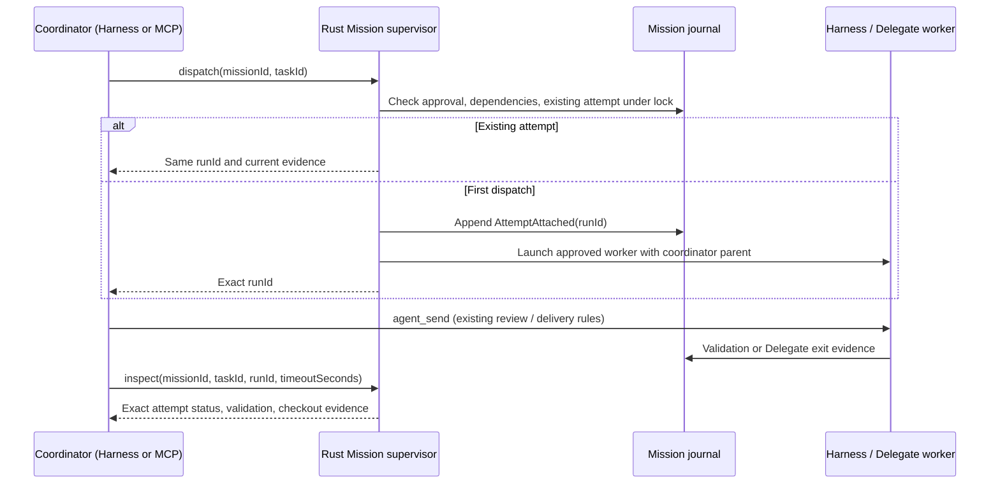

# Agent-driven Mission orchestration

A Goal Harness Run or a Delegate MCP client can use `mission_orchestrate` to
find approved tasks, dispatch a worker, and inspect its exact attempt. Both
adapters call the existing Rust Mission supervisor. No renderer must stay mounted.



## Workflow

The operator creates and approves the Mission in Mission Control, freezing each
task's worker kind, provider, model, and diff-review policy. The coordinator then
uses the same tool through native Harness calls or MCP:

```json
{"action":"list"}
```

```json
{"action":"dispatch","missionId":"release","taskId":"tests"}
```

Keep the returned `runId`. Use `agent_send` for a follow-up to that Run; the
existing receiving-operator review and safe-delivery rules still apply. Then
inspect that exact attempt, optionally waiting for up to 120 seconds:

```json
{"action":"inspect","missionId":"release","taskId":"tests","runId":"run_123","timeoutSeconds":30}
```

`timeoutSeconds: 0` (the default) is an immediate snapshot. `timedOut: true`
means the exact attempt has no terminal Mission evidence yet. It never cancels
work. Cancellation of the coordinator likewise does not roll back a durable
Mission dispatch.

## Receipt and evidence

The [JSON Schema](../schemas/klide-mission-orchestration.schema.json) is embedded
in the MCP output schema. Native tool metadata contains the same JSON value.

| Status | Meaning | Accepted? |
|---|---|---|
| `running` | Attached; no terminal Mission event yet | Unknown |
| `awaiting_review` | Delegate process exited | Unknown, even for exit code 0 |
| `accepted` | Mission validation accepted this attempt | Yes |
| `rejected` | Mission validation rejected this attempt | No |
| `dispatch_failed` | Launch failed after durable attachment | Unknown |
| `interrupted` | Recovery recorded an interrupted attempt | Unknown |

Inspection includes the recorded validation checks, exit code when available,
failure reason, and the Harness transcript summary when present. Missing summary
is `null`; it is never interpreted as success. A Delegate's self-published
coordination result remains available through `agent_read_result` and does not
replace operator review.

Checkout evidence includes HEAD, bounded diff statistics against HEAD, and
porcelain status. It is explicitly **shared checkout evidence**, not a patch
attributed to one attempt. It excludes committed changes and file contents;
untracked names appear in status. Git errors are returned as unavailable
evidence, not as a clean checkout. Review the actual branch/files before merging.

## Authority and retries

- No tool argument supplies an actor, workspace path, provider override, plan
  approval, acceptance, retry instruction, or merge command.
- Top-level Runs may coordinate the workspace's approved Missions. A worker
  assigned to a Mission is confined to it; an unassigned child cannot enumerate
  or dispatch other Missions. Unregistered Runs are refused.
- Native orchestration is offered and enforced only in Goal mode. MCP serves
  independently capable Delegate CLIs, as with the existing coordination tools.
- The normal Mission gate still requires approved dispatch settings and accepted
  dependencies. Agent dispatch will not add another attempt while a different
  attempt is active or awaiting review (the calling coordinator is excluded).
- Under the Mission writer lock, the attachment is persisted before launching.
  A repeated dispatch returns the latest existing attempt, including a failed
  attempt. It never silently retries or starts another paid worker. Intentional
  retries remain in Mission Control, where Run is a request to the supervisor
  (`mission_request_task`), not a second dispatcher.
- A newly dispatched worker records the coordinator as its parent in both the
  Harness and Delegate launch paths.
- A coordinator in a linked worktree uses Missions authored there when present;
  otherwise it discovers Missions in the owning checkout. Existing worktree-local
  Missions are preserved.



## Remaining orchestration work

This interface connects the durable workflow; it does not yet reproduce the
full isolated-worker workflow documented by
[Superset](https://docs.superset.sh/orchestration). Durable Mission dispatch still
uses the Mission checkout. The interactive launch path's worktree-per-run policy
has not been moved into Mission dispatch; doing that also needs explicit
handling of dependency branches and review evidence tied to immutable commits.

Delegate messages remain pull-based through `agent_wait`. Automatic wakeups,
recoverable delivery acknowledgements, and automatic integration are unchanged.
These limits are surfaced here and in the tool description rather than being
inferred from a process exiting or a terminal becoming idle.
