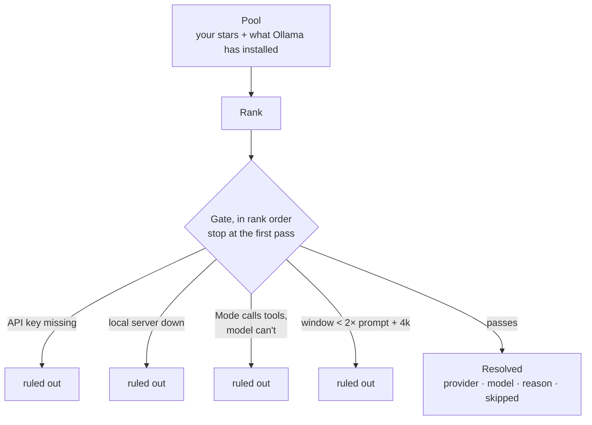

# Model routing — the `Auto` Provider

How Klide picks a model when the user doesn't. This document is the reasoning
behind `src-tauri/src/agent/routing.rs`; the code is the rule, this is why the
rule looks the way it does and what it deliberately is not.

Vocabulary is `CONTEXT.md`'s: **Provider**, **Run**, **Mode**, **Harness**,
**Transcript**. `Auto` is defined there too.

## The one-sentence version

**Rule out, then choose, then lock it in — and write down who did the work.**

Auto is a gate followed by a preference. The gate is not a score: nothing a
model does well puts it back in the pool once it has been ruled out. The
preference is the user's own — their stars — not a leaderboard.

## Where it lives

```mermaid
flowchart LR
    P[Picker<br/>provider = auto] -->|StartRunRequest<br/>+ preferredModels| S

    subgraph Rust — start_run
        S{provider == auto?} -->|no| F[failure budget → loop]
        S -->|yes| O{transcript has<br/>a RunStarted?}
        O -->|yes — continuation| L[reuse origin pair<br/>locked]
        O -->|no — first turn| R[routing::resolve]
        R --> F
        L --> F
    end

    F --> E1[RunStarted<br/>resolved provider + model]
    E1 --> E2[RouteResolved<br/>reason + skipped]
    E2 --> E3[ContextSnapshot → UserMessage → …]
```

Every Run — an AI panel turn, a headless Mission attempt, a nested subagent —
enters through `start_run` in `agent/mod.rs`. Resolving there means nothing
downstream ever sees the word `auto`: the failure budget keys on the real pair,
the run summary names it, `RunStarted` carries it, the adapters dial it. There
is one router and one place it runs.

## The rule



**Pool.** The user's starred pairs (every picker's star list, sent on the
request as `preferredModels`) plus every model Ollama reports installed.
Delegate CLIs are never candidates: they run on a subscription with their own
trust and cost model, and a routed run has to stay inside the Harness.

**Rank.** Three tiers, stable within each:

| Tier | Members | Order inside the tier |
|---|---|---|
| 1 | starred | cheapest input price first; unknown price last |
| 2 | local, unstarred | the Provider's default model, then by name |
| 3 | everything else | cheapest first |

Ties break on provider name, then model name. A router that picks differently
on identical input is a bug, so the order is total.

**Gate.** Candidates are asked in rank order and the walk stops at the first
that passes. A starred model that fits costs one probe, not one per installed
model. What the gate asks:

| Check | Source | Rejection recorded as |
|---|---|---|
| hosted Provider has a key | `providers::provider_key` | `no API key` |
| local server is up | `local_servers::local_server_is_up` | `server not running` |
| tool support, when the Mode is Plan or Goal | `models::ai_model_supports_tools` | `cannot use tools` |
| context window ≥ 2 × prompt tokens + 4 096 | `models::resolve_context_window` | `Nk window, job needs Mk` |

Chat does not require tools. The window floor is deliberately unclever: the
prompt needs room to be answered and to grow a few turns before compaction.

**Lock.** A continuation of an `auto` conversation reuses the pair its own
Transcript recorded (`read_run_origin`) and emits no `RouteResolved`. Context
accounting, compaction and the provider's prompt cache are all per model;
switching mid-thread would invalidate all three. Copilot's own docs say the
same thing from the other side — routing happens "along natural cache
boundaries" because mid-session switching "has shown increased cost without
ample improvements in quality."

## What the Transcript records

`RunStarted` already names the provider and model a run is about to use, so it
carries the *resolved* pair and every surface that reads it — the meta line,
Mission Control's row, the origin heal — shows what actually ran with no new
code.

`RouteResolved` follows it, once, only for runs that were requested as `auto`:

```json
{ "type": "route_resolved",
  "provider": "anthropic", "model": "claude-sonnet-4-6",
  "reason": "starred · $3/M · tools · 200k window",
  "skipped": ["anthropic claude-haiku-4-5: cannot use tools"] }
```

`skipped` names every candidate that ranked *above* the pick and what ruled it
out. The decision is auditable, not just its outcome.

When nothing passes, the run does not start and the error says what was tried:

> Auto found no model for a run that uses tools. Ruled out: anthropic
> claude-sonnet-4-6: no API key; ollama llama3.1:8b: server not running.

## Why this shape and not another

Other routers, and what each is built on:

| | Picks by | Needs |
|---|---|---|
| Cursor Router, Copilot Auto | a classifier trained on their own traffic, plus live model health | a fleet's worth of requests |
| RouteLLM | a strong/weak classifier trained on Arena preference votes | a preference dataset |
| OpenRouter Auto | community spend per task type over a trailing week | a marketplace |
| LiteLLM, Portkey | declared tiers + a heuristic scorer, fallbacks as a separate chain | a config file |

Klide has one bench. A trained router would be trained on n = 1, and a market
signal follows a crowd that isn't using this repo. What Klide *does* have that
none of them can see: which keys are set, which local servers are warm, what
the user starred, how big this prompt is, and — eventually — how each model's
attempts on this repo were accepted or rejected. LiteLLM's shape (declared
tiers, cheap deterministic scorer, failure handled separately) is the one that
fits that, so that is the shape here.

Four things every router above agrees on, all of which this follows:

1. Filter by policy before ranking.
2. Availability is a routing signal, not an error case.
3. Never re-route mid-conversation.
4. Show the model that ran.

## What it deliberately is not

- **Not per-turn.** One decision per conversation, locked.
- **Not a classifier.** No model call in front of a message; the task shape
  (Mode, prompt size) is the signal, and it is free.
- **Not a delegate dispatcher.** Claude Code, Codex, OpenCode and Oh My Pi are
  never candidates.
- **Not silent.** Every pick and every rejection is on the Transcript.

## Surfaces

- The picker's provider menu gains a **Routed › Auto** row above Local. With
  Auto chosen the model picker is hidden — there is nothing to pick — and the
  turn's meta line names the resolved model once the run starts.
- An Auto panel restores the most recent thread of *any* Provider on reopen
  (`latestRestorableConversationId`): its threads record the Provider each
  landed on, never `auto`, and continuing one re-locks to that origin in Rust.
- Model inspection commands answer for `auto` without a network call: tools
  `true` (guaranteed by the gate), vision and reflection `false` (unknown
  until routed), context window the name heuristic's floor.

## Next

In the order they earn their place:

1. **Privacy as a gate.** A `local-only` policy that rules out every hosted
   Provider. The gate has the slot; the setting does not exist yet.
2. **Stars in Rust.** Today the renderer sends them on the request, so a
   headless Mission attempt has none. A file under `~/.klide/` would let every
   producer see the same preference.
3. **Auto at Mission approval.** Approval freezes a concrete pair into the
   task file, so a Mission never arrives as `auto`. Resolving at approval
   time, and writing the pair back, is the right seam — not dispatch.
4. **Escalation as a new attempt.** When `steering.rs` or `failure_budget.rs`
   trips, park the attempt and retry one tier up with `escalation: true`.
   Missions already have the attempt model; the panel wants a
   "Retry with a stronger model" action. Never a swap inside the run.
5. **Outcome-aware tie-breaks.** The run ledger records accepted vs rejected
   attempts per model on this repo — RouteLLM's preference signal, honestly
   collected. Small, so it belongs inside a tier as a tie-break, never as the
   classifier.
